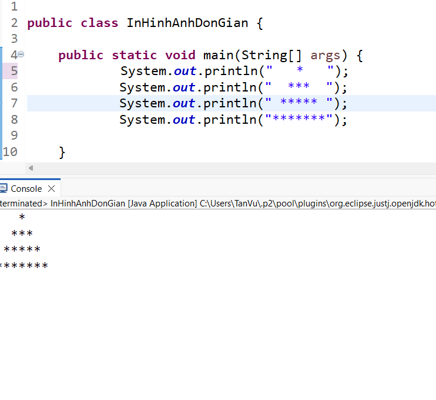

| 👤 Thông tin        | 📌 Chi tiết          |
|---------------------|----------------------|
| Trường              | Đại học nha trang    |
| Sinh viên           | Huỳnh Tấn Vũ         |
| MSSV                | 66134543             |
| Giảng viên          | Mai Cường Thọ        |
| Ngôn ngữ            | Java                 |
| IDE                 | Eclipse              |

## 📚 Giới thiệu 

📌 Repository này dùng để lưu trữ các bài giảng của giảng viên.  

🚀 Nội dung được xây dựng theo lộ trình từ cơ bản đến nâng cao,  
giúp người học nắm vững kiến thức một cách hệ thống.

📖 Tài liệu được sắp xếp từ những phần nhỏ nhất đến các nội dung phức tạp hơn,  có thể sử dụng làm tài liệu tham khảo trong quá trình học tập.

## 💻Tổng Quan Các Dự Án 

### Bài 1: Khởi đầu về lập trình java
####  📄 Cơ bản: In hình ảnh cơ bản
[Chi tiết](./https://github.com/tanvuhehehe/66134543-JavaProgramming/tree/main/Bai1_BaiTap2_InHinhAnhDonGian/src)

- **Mục Đích:** Để cho người mới học biết cách in ra màn hình trong `main`
- **Nội dung:** Đọc được vể cái cơ bản của class `InHinhAnhDonGian`

